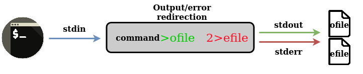

# Summary

In this session you have discovered the 3 data streams of an unix command: the input stream (`stdin`), the output stream (`strout`) and the error stream (`stderr`):

You have also seen that these streams use the terminal display by default but that they can be redirected to intermediate files:

And more importantly, did you know that with pipes, you can "skip" intermediate files and build a "complex" command that combines the succession of several unit commands:

